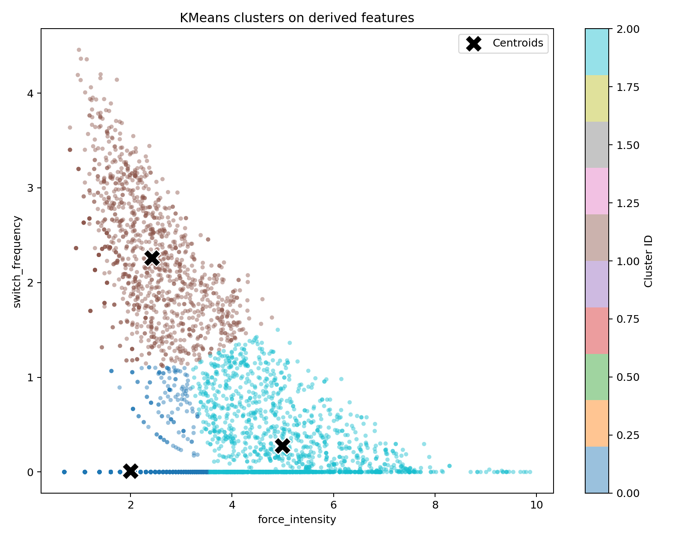

# Clustering Pipeline

모바일 앱 사용 로그에서 파생 변수(derived features)를 만들고, KMeans 클러스터링 결과를 시각화/평가하는 파이프라인입니다.

- 주요 파생 변수
  - `force_intensity`
  - `switch_frequency`
- 비교 대상
   - `MinMaxScaler + KMeans`

## 1. 폴더 구성

- `main.py`: 단일 k에 대해 전처리, 클러스터링, 시각화, 메트릭 저장까지 한 번에 실행
- `k_range_evaluation.py`: k 범위를 바꿔가며 성능(실루엣, DBI, inertia) 비교
- `preprocessing.py`: 입력 검증, 결측 제거, 왜도(skewness) 기반 log1p 적용 판단, 파생 변수 생성
- `modeling.py`: KMeans 학습 및 지표 계산
- `visualization.py`: 히스토그램/산점도/비교 시각화 생성
- `constants.py`: 공통 상수 정의
- `result/0402_image/`: 실행 결과 이미지/CSV 저장 폴더(기본)

## 2. 입력 데이터 요구사항

CSV에 아래 컬럼이 반드시 있어야 합니다.

- `foreground_app_duration_sum`
- `foreground_app_switch_per_hour`
- `concentration_ratio`

`preprocessing.py`에서 위 3개 컬럼만 사용하며, 결측값(`NaN`)이 있는 행은 제거합니다.

## 3. 파이프라인 동작 요약

1. CSV 로드 및 필수 컬럼 검증
2. 결측값 제거
3. source 변수 2개의 왜도 계산
   - `foreground_app_duration_sum`
   - `foreground_app_switch_per_hour`
4. 두 변수 모두 강한 우측 치우침(`skew > 1.0`)이고 음수가 없으면 `log1p` 적용
5. 파생 변수 생성
   - `force_intensity = duration_base * concentration_ratio`
   - `switch_frequency = switch_base * (1 - concentration_ratio)`
6. MinMaxScaler 적용
7. KMeans 학습 및 지표 계산
   - Silhouette (높을수록 좋음)
   - Davies-Bouldin Index (낮을수록 좋음)
8. 시각화 및 결과 저장

출력 경로는 실행 위치와 무관하게 프로젝트 루트의 `result/` 하위로 정규화됩니다.

## 4. 설치

Python 3.9+ 권장

```bash
pip install numpy pandas matplotlib scikit-learn
```

## 5. 실행 방법

### 5.1 단일 k 실행 (`main.py`)

프로젝트 루트(`qwer`)에서 실행 예시:

```bash
python clustering_pipeline/main.py --csv mendeley_v5.csv --k 4 --out-dir result/0402_image
```

옵션:

- `--csv`: 입력 CSV 경로 (기본: `mendeley_v5.csv`)
- `--k`: 클러스터 개수 (기본: `4`)
- `--out-dir`: 출력 폴더 (기본: 프로젝트 루트 `result/0402_image`)

생성 파일:

- `derived_feature_histograms.png`
- `derived_feature_histograms_minmax.png`
- `kmeans_force_switch_clusters.png`
- `kmeans_metrics.csv`

### 5.2 k 범위 평가 (`k_range_evaluation.py`)

```bash
python clustering_pipeline/k_range_evaluation.py --csv mendeley_v5.csv --k-min 3 --k-max 8 --csv-dir result/0402_csv --image-dir result/0402_image
```

옵션:

- `--k-min`: 최소 k (2 이상)
- `--k-max`: 최대 k (`k-min` 이상)
- `--csv-dir`: k 범위 메트릭 CSV 출력 폴더
- `--image-dir`: 엘보우 유사 진단 플롯 출력 폴더

생성 파일 예시:

- `result/0402_csv/kmeans_k_3_8_metrics.csv`
- `result/0402_image/kmeans_elbow_like_k_3_8.png`

## 6. 현재 결과 이미지 예시

아래 이미지는 현재 폴더의 `result/0402_image/`에 저장된 결과를 그대로 참조합니다.




## 7. 해석 팁

- 실루엣 점수는 군집 분리/응집이 좋을수록 상승합니다.
- DBI는 군집 간 분리가 좋고 군집 내부 응집이 높을수록 감소합니다.
- 두 지표를 함께 보고 k를 선택하는 것이 안정적입니다.
- MinMax 적용 후 분포 압축 정도를 히스토그램으로 함께 확인하면 설명력 확보에 도움이 됩니다.
